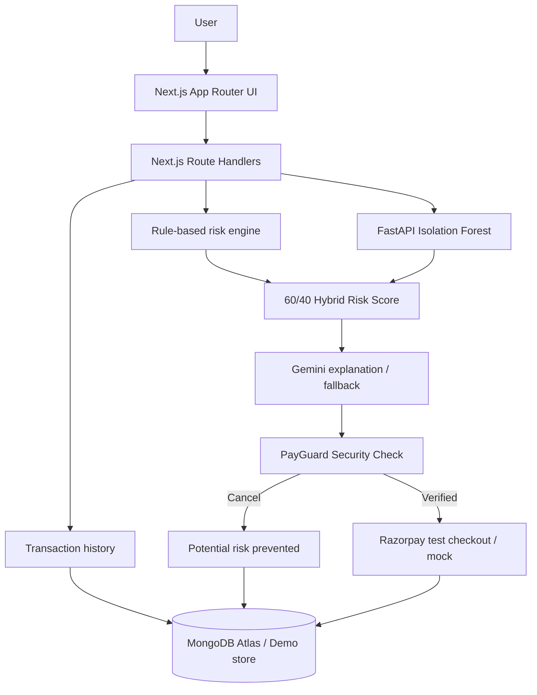

# PayGuard AI

> **Think Before You Pay.**

PayGuard AI is a pre-payment fraud and anomaly detection layer. It examines a payment against historical behaviour, understandable safety rules, and an Isolation Forest model **before** Razorpay Checkout opens. Users receive a clear explanation and retain the final decision.

## The problem and solution

Payment systems often surface suspicious activity after money has moved. PayGuard moves that decision point earlier. It identifies unusual amounts, near-duplicates, first-time beneficiaries, and abnormal frequency; combines those signals with an unsupervised anomaly score; explains the result; and allows the user to cancel or continue.

Why PayGuard?

- Prevention-first rather than recovery-first
- Explainable risk signals rather than a black-box fraud label
- Resilient demo mode that works without cloud credentials
- Server-authoritative scores and secure payment order creation
- Transparent model evaluation from a held-out dataset

## Architecture



## Key features

- Fintech dashboard with risk distribution and prevented-value analytics
- Guided payment form and polished security-check screen
- Rule checks for amount ratio, duplicates, beneficiaries, and frequency
- Isolation Forest service with synthetic training/test split
- Accuracy, precision, recall, F1, false-positive rate, and confusion matrix computed from the test set
- Transaction filters, drill-down details, and risk alert cards
- Gemini explanation integration with deterministic fallback
- Razorpay test integration with server-only secret and mock demo success
- MongoDB Atlas persistence with automatic seeded demo fallback
- Email/password account creation with scrypt hashing and HTTP-only sessions

## Risk detection

The API calculates average, median, maximum, historical count, recent frequency, hours since the last payment, beneficiary novelty, similarity to recent payments, and amount-to-average ratio. The understandable rule score contributes 60%; the normalized Isolation Forest anomaly score contributes 40%. Scores are clamped to 0–100: LOW 0–30, MEDIUM 31–60, and HIGH 61–100. Configuration lives in `lib/riskEngine.js`.

The LLM never computes risk. It receives the completed signals and turns them into two concise sentences. If Gemini or the ML service is unavailable, safe deterministic fallbacks preserve the entire flow.

## Setup

Requirements: Node.js 18.17+, npm, and optionally Python 3.10+ and MongoDB Atlas.

```bash
npm install
copy .env.example .env.local
npm run dev
```

On Windows, `npm run dev` automatically clears the generated `.next` cache first. This avoids stale `readlink EINVAL` errors that can occur when the project is inside a OneDrive-synchronized folder. You can also run `npm run clean` manually.

Open `http://localhost:3000`. With `DEMO_MODE=true`, no external credentials are required.

To run live anomaly detection:

```bash
cd ml-service
python -m venv .venv
.venv\Scripts\activate
pip install -r requirements.txt
python generate_dataset.py
python train.py
uvicorn main:app --reload --port 8000
```

The first FastAPI start also trains the model automatically if an artifact is absent. Metrics are always derived from held-out labelled samples—never hardcoded.

## Environment variables

| Variable | Purpose |
|---|---|
| `MONGODB_URI` | Optional Atlas connection string |
| `RAZORPAY_KEY_ID` | Razorpay test public key |
| `RAZORPAY_KEY_SECRET` | Server-only Razorpay secret |
| `GEMINI_API_KEY` | Optional explanation service key |
| `ML_SERVICE_URL` | FastAPI URL, default `http://localhost:8000` |
| `DEMO_MODE` | Enables seeded storage and mock checkout fallbacks |
| `AUTH_SECRET` | Long random server-only key used to sign login sessions |

Never place real secrets in client code or commit `.env.local`.

## Demo scenarios

1. **Normal:** ABC Traders, ₹6,000 → LOW risk → continue.
2. **Amount anomaly:** ABC Traders, ₹45,000 → HIGH risk with ~7.8× amount signal.
3. **Duplicate:** complete/record ₹45,000, then retry it → duplicate and frequency signals.
4. **New beneficiary:** New Company, ₹8,000 → elevated MEDIUM risk without calling it fraud.

Demo data is available automatically. When MongoDB is configured, transactions persist there; otherwise the process-local store resets on server restart. `npm run seed` documents this behaviour.

## Razorpay flow

Risk analysis completes first. Only after explicit confirmation does the server create an order. Real checkout responses are verified with an HMAC on the server before being recorded. Missing credentials produce a clearly demo-scoped mock success only when demo mode is enabled.

## Screenshots

- `[Dashboard screenshot]`
- `[PayGuard Security Check screenshot]`
- `[Model Performance screenshot]`

## Future scope

Streaming bank signals, merchant networks, device intelligence, adaptive per-user thresholds, human feedback loops, model drift monitoring, signed risk tokens, multi-tenant RBAC, and bank-grade audit exports.

## Team

Built for the Buildathon by **Team PayGuard**.
